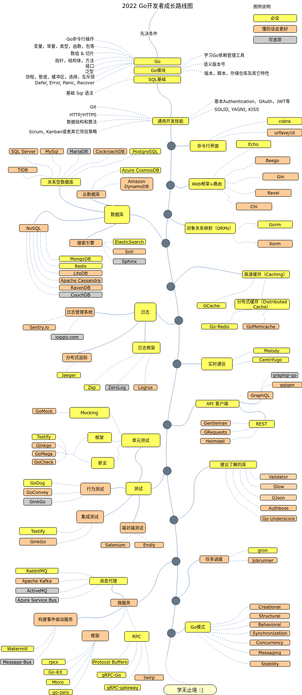

# Go 开发者成长路线图

> 在 2021 年 成为一名 [Go](https://golang.org/) 开发者。在下边有一个路线图，如果你想要成为一名Go语言的开发者的话，你可以沿着这张图里面的路径去学习，里面记录了一些你可能也想学习的库。
------

## 路线图

## 资源

1. 先决条件

   - [Go](https://golangbot.com/)
   - [SQL](https://www.w3schools.com/sql/default.asp)

2. 通用开发技能

   - 学习GIT，在GitHub上建立一些仓库，与其它人分享你的代码
   - 了解 HTTP(S) 协议，request 方法（GET, POST, PUT, PATCH, DELETE, OPTIONS）
   - 不要害怕使用Google，[Google 搜索的力量](http://www.powersearchingwithgoogle.com/)
   - 看一些和数据结构以及算法有关的书籍
   - 学习关于认证的基础实现
   - 面向对象原则等等

3. 命令行工具
   1. [cobra](https://github.com/spf13/cobra)
   2. [urfave/cli](https://github.com/urfave/cli)

4. 网页框架 + 路由

   1. [Echo](https://github.com/labstack/echo)
   2. [Beego](https://github.com/astaxie/beego)
   3. [Gin](https://github.com/gin-gonic/gin)
   4. [Revel](https://github.com/revel/revel)
   5. [Chi](https://github.com/go-chi/chi)

5. 数据库

   1. 关系型
      - [SQL Server](https://www.microsoft.com/en-us/sql-server/sql-server-2017)
      - [PostgreSQL](https://www.postgresql.org/)
      - [MariaDB](https://mariadb.org/)
      - [MySQL](https://www.mysql.com/)
      - [CockroachDB](https://www.cockroachlabs.com/)
   2. 云数据库
      - [CosmosDB](https://docs.microsoft.com/en-us/azure/cosmos-db)
      - [DynamoDB](https://aws.amazon.com/dynamodb/)
   3. 搜索引擎
      - [ElasticSearch](https://www.elastic.co/)
      - [Solr](http://lucene.apache.org/solr/)
      - [Sphinx](http://sphinxsearch.com/)
   4. NoSQL
      - [MongoDB](https://www.mongodb.com/)
      - [Redis](https://redis.io/)
      - [Apache Cassandra](http://cassandra.apache.org/)
      - [RavenDB](https://github.com/ravendb/ravendb)
      - [CouchDB](http://couchdb.apache.org/)

6. 对象关系映射框架

   1. [Gorm](https://github.com/jinzhu/gorm)
   2. [Xorm](https://github.com/go-xorm/xorm)

7. 高速缓存

   1. [GCache](https://github.com/bluele/gcache)
   2. 分布式缓存
      - [Go-Redis](https://github.com/go-redis/redis)
      - [GoMemcached](https://github.com/bradfitz/gomemcache)

8. 日志

   1. 日志框架
      - [Zap](https://github.com/uber-go/zap)
      - [ZeroLog](https://github.com/rs/zerolog)
      - [Logrus](https://github.com/sirupsen/logrus)
   2. 日志管理系统
      - [Sentry.io](http://sentry.io)
      - [Loggly.com](https://loggly.com)
   3. 分布式追踪
      - [Jaeger](https://www.jaegertracing.io/)

9. 实时通信
   1. [Socket.IO](https://socket.io/)

10. API 客户端

    1. REST
       - [Gentleman](https://github.com/h2non/gentleman)
       - [GRequests](https://github.com/kennethreitz/grequests)
       - [heimdall](https://github.com/heimdal/heimdal)
    2. [GraphQL](https://graphql.org/)
       - [gqlgen](https://github.com/99designs/gqlgen)
       - [graphql-go](https://github.com/graph-gophers/graphql-go)

11. 最好知道

    - [Validator](https://github.com/chriso/validator.js/)
    - [Glow](https://github.com/pytorch/glow)
    - [GJson](https://github.com/tidwall/gjson)
    - [Authboss](https://github.com/volatiletech/authboss)
    - [Go-Underscore](https://github.com/ahl5esoft/golang-underscore)

12. 测试

    1. 单元、行为和集成测试
       1. [GoMock](https://github.com/golang/mock)
       2. [Testify](https://github.com/stretchr/testify)
       3. [GinkGo](https://github.com/onsi/ginkgo)
       4. [GoMega](https://github.com/onsi/gomega)
       5. [GoCheck](https://github.com/go-check/check)
       6. [GoDog](https://github.com/DATA-DOG/godog)
       7. [GoConvey](https://github.com/smartystreets/goconvey)
    2. 端对端测试
       - [Selenium](https://github.com/tebeka/selenium)
       - [Endly](https://github.com/viant/endly)

13. 任务调度

    - [Gron](https://github.com/roylee0704/gron)
    - [JobRunner](https://github.com/bamzi/jobrunner)

14. 微服务

    1. 消息代理
       - [RabbitMQ](https://www.rabbitmq.com/tutorials/tutorial-one-go.html)
       - [Apache Kafka](https://kafka.apache.org/)
       - [ActiveMQ](https://github.com/apache/activemq)
       - [Azure Service Bus](https://docs.microsoft.com/en-us/azure/service-bus-messaging/service-bus-messaging-overview)
    2. 构建事件驱动型服务
       - [Watermill](https://github.com/ThreeDotsLabs/watermill)
       - [Message-Bus](https://github.com/vardius/message-bus)
    3. 框架
         - [GoKit](https://github.com/go-kit/kit)
         - [go-zero](https://github.com/tal-tech/go-zero)
         - [Micro](https://github.com/micro/go-micro)
         - [rpcx](https://github.com/smallnest/rpcx)
    4. RPC
         - [Protocol Buffers](https://github.com/protocolbuffers/protobuf)
         - [gRPC-Go](https://github.com/grpc/grpc-go)
         - [gRPC-Gateway](https://github.com/grpc-ecosystem/grpc-gateway)
         - [Twirp](https://github.com/twitchtv/twirp)

15. [Go-模式](https://github.com/tmrts/go-patterns)
