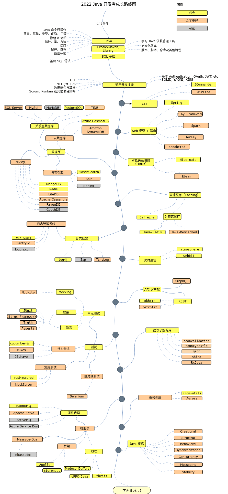

# Java 开发者成长路线图

> 在 2021 年成为一名 Java 开发者。下面有一个路线图，如果你想要成为一名 Java 语言的开发者的话，你可以沿着这张图里面的路径去学习，里面记录了一些你可能也想学习的库。
----

## 路线图

## 资源

1. 先决条件

   - [Java](https://www.java.com/en/download/)
   - [Gradle](https://gradle.org/)
   或 [Maven](https://maven.apache.org/)
   - [SQL](https://www.w3schools.com/sql/default.asp)

2. 通用开发技能

   - 学习 GIT，在 GitHub 上建立一些仓库，与其它人分享你的代码
   - 了解 HTTP(S) 协议，request 方法（GET, POST, PUT, PATCH, DELETE, OPTIONS）
   - 不要害怕使用Google，[Google 搜索的力量](http://www.powersearchingwithgoogle.com/)
   - 看一些和数据结构以及算法有关的书籍
   - 学习关于认证的基础实现
   - 面向对象原则等等

3. 命令行工具
   1. [args4j](http://args4j.kohsuke.org/)
   2. [JCommander](http://jcommander.org/)
   3. [airline](https://github.com/airlift/airline)

4. 网页框架 + 路由

   1. [Spring](https://spring.io/)
   2. [Play Framework](https://www.playframework.com/)
   3. [Spark](http://sparkjava.com/)
   4. [Jersey](https://jersey.github.io/)
   5. [nanohttpd](https://github.com/NanoHttpd/nanohttpd)

5. 数据库

   1. 关系型数据库
      1. [SQL Server](https://www.microsoft.com/en-us/sql-server/sql-server-2017)
      2. [PostgreSQL](https://www.postgresql.org/)
      3. [MariaDB](https://mariadb.org/)
      4. [MySQL](https://www.mysql.com/)
      5. [Oracle](https://www.oracle.com/database/)
   2. 云数据库
      - [CosmosDB](https://docs.microsoft.com/en-us/azure/cosmos-db)
      - [DynamoDB](https://aws.amazon.com/dynamodb/)
   3. 搜索引擎
      - [ElasticSearch](https://www.elastic.co/)
      - [Solr](http://lucene.apache.org/solr/)
      - [Sphinx](http://sphinxsearch.com/)
   4. NoSQL
      - [MongoDB](https://www.monJavadb.com/)
      - [Redis](https://redis.io/)
      - [Apache Cassandra](http://cassandra.apache.org/)
      - [LiteDB](https://github.com/mbdavid/LiteDB)
      - [RavenDB](https://github.com/ravendb/ravendb)
      - [CouchDB](http://couchdb.apache.org/)

6. 对象关系映射框架（ORMs）

   1. [Hibernate](https://hibernate.org/)
   2. [Ebean](https://ebean.io/)
   3. [BelleORM](https://github.com/codersgarage/BelleORM)

7. 高速缓存

   1. [Caffeine](https://github.com/ben-manes/caffeine)
   2. [EHCache](http://www.ehcache.org/)
   3. [Cache2k](https://cache2k.org/)
   4. 分布式缓存
      1. [Java-Redis](https://github.com/xetorthio/jedis)
      2. [Java-Memcached](https://redislabs.com/lp/memcached-java/)
      3. [Infinispan](http://infinispan.org/)

8. 日志

   1. 日志框架
      - [Zap](https://github.com/uber-Java/zap)
      - [TinyLog](http://www.tinylog.org/)
      - [log4j](https://logging.apache.org/log4j)
   2. 日志管理系统
      - [ELK Stack](https://www.elastic.co/what-is/elk-stack)
      - [Sentry.io](http://sentry.io)
      - [Loggly.com](https://loggly.com)
      - [Tracer](https://github.com/zalando/tracer)

9. 实时通信
   1. [Socket.IO](https://socket.io/)
   2. [atmosphere](https://github.com/Atmosphere/atmosphere)
   3. [webbit](https://github.com/webbit/webbit)

10. API 客户端

    1. REST
       - [okhttp](https://square.github.io/okhttp/)
       - [retrofit](https://square.github.io/retrofit/)
    2. [GraphQL](https://graphql.org/)

11. 最好知道

    - [Beanvalidation](https://beanvalidation.org/)
    - [bouncycastle](https://www.bouncycastle.org/java.html)
    - [gson](https://github.com/google/gson)
    - [Apache Shiro](https://shiro.apache.org/)
    - [JJWT](https://github.com/jwtk/jjwt)
    - [RxJava](https://github.com/ReactiveX/RxJava)

12. 测试

    1. 单元、行为、集成和载入测试
       1. [JUnit](http://junit.org/)
       2. [CitrusFramework](https://citrusframework.org/)
       3. [Gatling](https://gatling.io/)
       4. [Tsung](http://tsung.erlang-projects.org/)
       5. [Mockito](https://site.mockito.org/)
       6. [Truth](https://github.com/google/truth)
       7. [Assertj](https://joel-costigliola.github.io/assertj)
       8. [cucumber-jvm](https://github.com/cucumber/cucumber-jvm)
       9. [cukes](https://github.com/ctco/cukes)
       10. [hoverfly-java](https://github.com/SpectoLabs/hoverfly-java)
       11. [rest-assured](https://github.com/rest-assured/rest-assured)
       12. [jbehave](https://jbehave.org/)
       13. [Mockserver](https://www.mock-server.com)

    2. 端对端测试
       - [Selenium](https://github.com/tebeka/selenium)

13. 任务调度

    - [Aurora](https://aurora.apache.org/)
    - [elasticjob](https://github.com/elasticjob/elastic-job-lite)
    - [Sundial](https://github.com/knowm/Sundial)
    - [cron-utils](https://github.com/jmrozanec/cron-utils)

14. 微服务

    1. 消息代理
       - [RabbitMQ](https://www.rabbitmq.com/tutorials/tutorial-one-javascript.html)
       - [Apache Kafka](https://www.npmjs.com/package/kafka-node)
       - [ActiveMQ](https://github.com/apache/activemq)
       - [Azure Service Bus](https://docs.microsoft.com/en-us/azure/service-bus-messaging/service-bus-messaging-overview)
    2. 消息总线
       - [mbassador](https://github.com/bennidi/mbassador)
       - [rmq](https://github.com/xetorthio/rmq)
    3. 框架
         - [Apollo](https://spotify.github.io/apollo/)
         - [lagom-framework](https://www.lightbend.com/lagom-framework)
         - [micronaut](https://micronaut.io/)
         - [eureka](https://github.com/Netflix/eureka)
         - [helidon](https://helidon.io/#/)
         - [armeria](https://github.com/line/armeria)
    4. RPC
         - [Protocol Buffers](https://github.com/protocolbuffers/protobuf)
         - [gRPC-Java](https://github.com/grpc/grpc-java)
         - [thrift](https://thrift.apache.org/)

15. [Java-模式](https://github.com/iluwatar/java-design-patterns)
