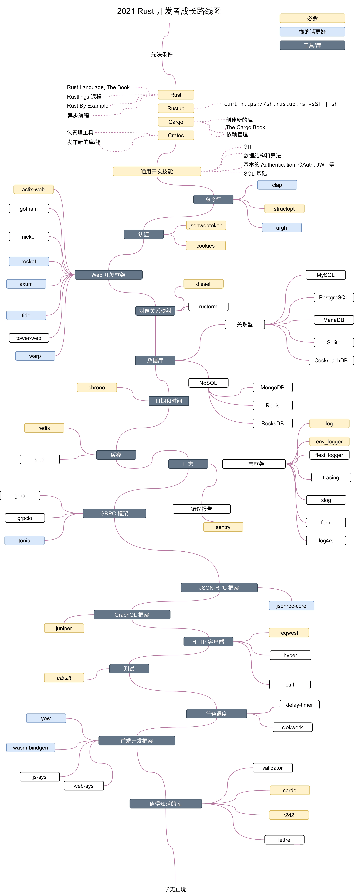

# Rust 开发者成长路线图

> 在 2021 年成为一名 [Rust](https://www.rust-lang.org/zh-CN/) 开发者。在下边有一个路线图，如果你想要成为一名 Rust 语言的开发者的话，你可以沿着这张图里面的路径去学习，里面记录了一些你可能也想学习的库。
------

## 路线图

## 资源

1. 先决条件

   - [Rust](https://www.rust-lang.org/)
   - [The Book](https://doc.rust-lang.org/book/)
   - [Rustlings 课程](https://github.com/rust-lang/rustlings/)
   - [Rust by Example](https://doc.rust-lang.org/stable/rust-by-example/)
   - [异步编程](https://rust-lang.github.io/async-book/)
   - [Rustup](https://www.rust-lang.org/tools/install)
   - [Cargo Book](https://doc.rust-lang.org/cargo/index.html)
   - [Crates.io](https://crates.io/)

2. 命令行

   - [clap](https://crates.io/crates/clap)
   - [structopt](https://crates.io/crates/structopt)
   - [argh](https://crates.io/crates/argh)

3. Web 框架

   - [actix-web](https://crates.io/crates/actix-web)
   - [gotham](https://crates.io/crates/gotham)
   - [nickel](https://crates.io/crates/nickel)
   - [rocket](https://crates.io/crates/rocket)
   - [axum](https://github.com/tokio-rs/axum)
   - [tide](https://crates.io/crates/tide)
   - [tower-web](https://crates.io/crates/tower-web)
   - [warp](https://crates.io/crates/warp)

4. 对像关系映射

   - [diesel](https://crates.io/crates/diesel)
   - [rustorm](https://crates.io/crates/rustorm)

5. 缓存

   - [redis](https://crates.io/crates/redis)
   - [sled](https://crates.io/crates/sled)

6. 日志

   - [log](https://crates.io/crates/log)
   - [env_logger](https://crates.io/crates/env_logger)
   - [flexi_logger](https://crates.io/crates/flexi_logger)
   - [slog](https://crates.io/crates/slog)
   - [fern](https://crates.io/crates/fern)
   - [log4rs](https://crates.io/crates/log4rs)
   - [sentry](https://crates.io/crates/sentry)

7. GRPC 框架

   - [grpc](https://crates.io/crates/grpc)
   - [grpcio](https://crates.io/crates/grpcio)
   - [tonic](https://crates.io/crates/tonic)

8. JSON-RPC 框架

   - [jsonrpc-core](https://crates.io/crates/jsonrpc-core)

9. GraphQL 框架

   - [juniper](https://crates.io/crates/juniper)

10. HTTP 客户端

    - [reqwest](https://crates.io/crates/reqwest)
    - [curl](https://crates.io/crates/curl)

11. 测试

    - _[Inbuilt](https://doc.rust-lang.org/book/ch11-00-testing.html)_

12. Task 调度

    - [clokwerk](https://crates.io/crates/clokwerk)
    - [delay-timer](https://crates.io/crates/delay_timer)

13. 前段开发框架

    - [yew](https://crates.io/crates/yew)
    - [wasm-bindgen](https://crates.io/crates/wasm-bindgen)
    - [js-sys](https://crates.io/crates/js-sys)
    - [web-sys](https://crates.io/crates/web-sys)

14. 值得了解的库

    - [validator](https://crates.io/crates/validator)
    - [serde](https://crates.io/crates/serde)
    - [r2d2](https://crates.io/crates/r2d2)
    - [lettre](https://crates.io/crates/lettre)

15. 其他内容

    - [Rust in 30 min](https://fasterthanli.me/articles/a-half-hour-to-learn-rust)
